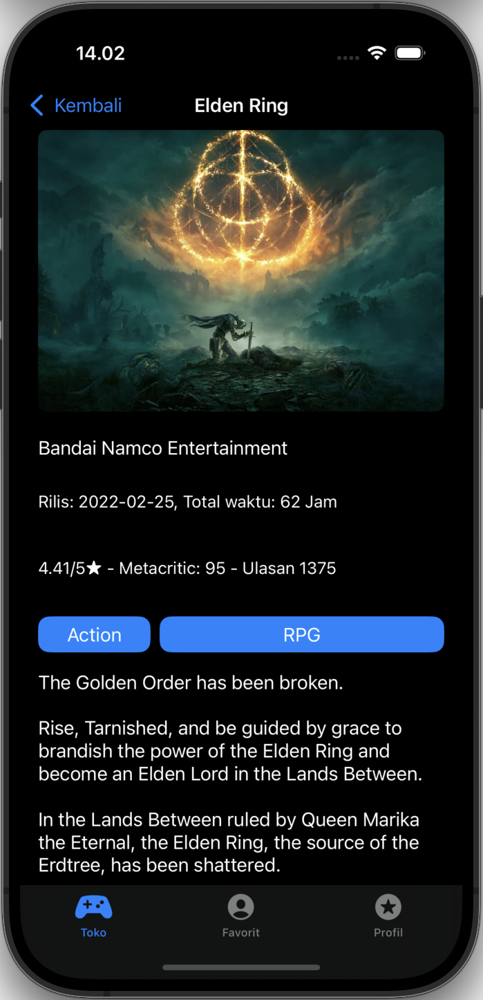
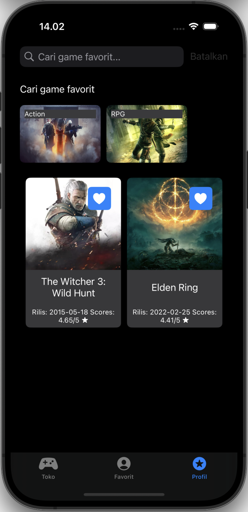
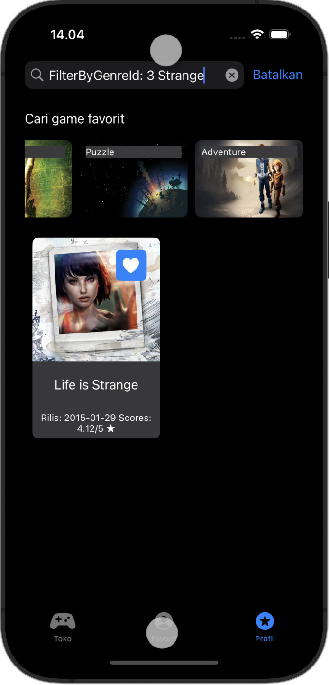
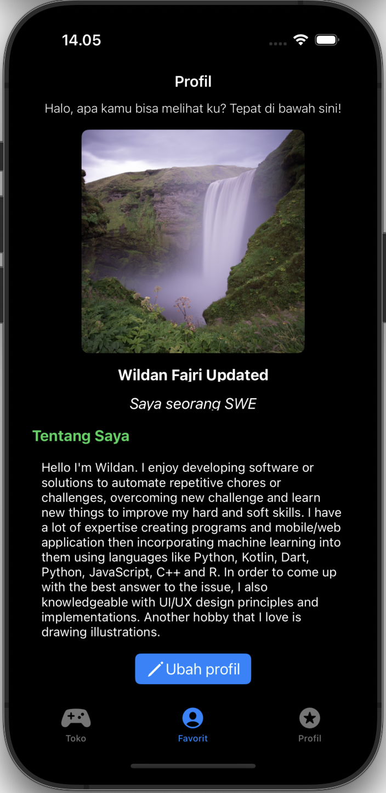
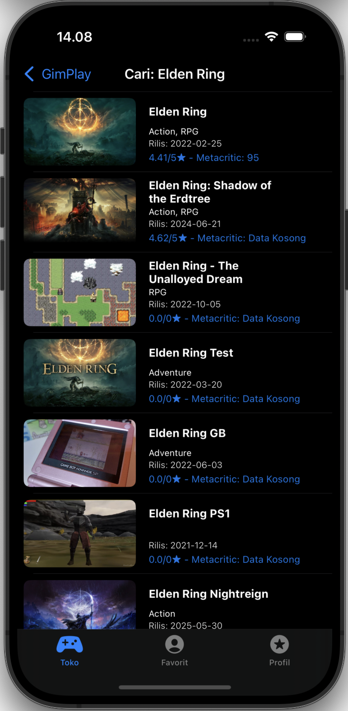
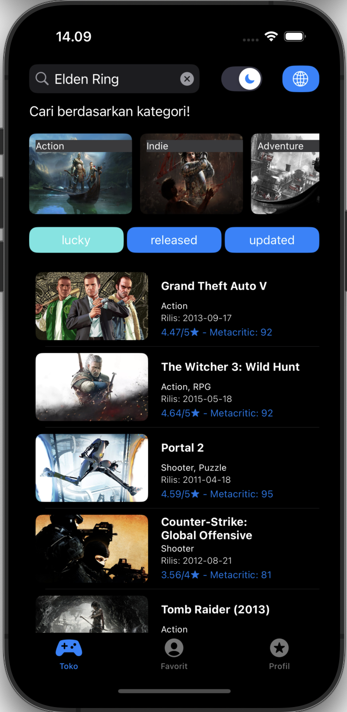

# GimPlay - Native iOS Gamer Apps

## 📸 Screenshots

<table>
  <tr>
    <td></td>
    <td></td>
    <td></td>
  </tr>
  <tr>
    <td></td>
    <td></td>
    <td></td>
  </tr>
</table>

## ✨ Features

- Remote sources integration ([RAWG API Documentation](https://api.rawg.io/docs/)) using **Alamofire**
- Local sources offline-first features using **Realm DB** for favourites games
- Infinite scroll using paging & advanced search & filtering using game ID, genre ID and game title
- Customizable profile page
- Dark Modes
- Support EN & ID Language

## Tech & Best practices implementations
- CI/CD with CodeMagic - iOS Native build
- Implement **Dependency Injection** (Swinject + SwinjectStoryboard)
- Implement **Reactive Programming** (ReactiveX)
- Implement **Clean Architecture**, **VIPER**, and **Modularization**

## 📦 Packages

- **SwiftLint** – 0.51.0  
- **RxSwift** – 6.0.0 ≥ Next Major  
- **Alamofire** – 5.0.0 ≥ Next Major  
- **Realm** – 10.49.3  
- **Swinject** – 2.0.0 ≥ Next Major  

## Project Structure

